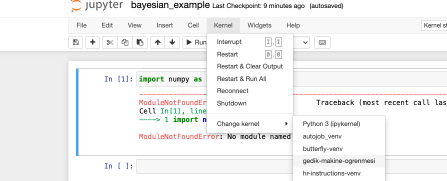

# Setup

Bilgisayarinizda python kodu calistirabildiginizi ve `pip`in kurulu oldugunu varsayiyorum.

Oncelikle bu repoyu local bilgisayariniza kopyalayin ve root directory'e gidin.

venv kurun:

```
python -m venv venv
```


virtual environment'i aktive edin:

```
source venv/bin/activate
```

gerekli kutuphaneleri yukleyin:

```
pip install -r requirements.txt
```

ipykernel kutuphanesini yukleyin:

```
pip install ipykernel
```


venv'inizi jupyter kernel olarak ekleyin:

```
python -m ipykernel install --user --name=gedik-makine-ogrenmesi
```


Jupyter notebook'u calistirin:

```
jupyter notebook
```

Asagidaki ornekteki gibi `gedik-makine-ogrenmesi` kernelini secin



